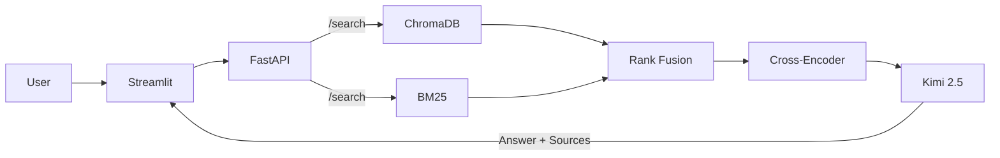

# Step 5 — Polish (README, CI/CD, Docker, Code Quality)

## Objective

Prepare the project for public GitHub showcase. A recruiter or hiring manager should be able to:
1. Understand the project in 30 seconds from the README
2. Clone, run `docker compose up`, and have it working
3. See clean, professional code

---

## 5.1 — Professional README

### File: `README.md`

Structure:

```markdown
# 📚 Semantic RAG — Technical Documentation Assistant

> A production-quality Retrieval-Augmented Generation system over LangChain, FastAPI, and Python documentation. Built as an AI Engineering portfolio project.


## ✨ Features

- **Hybrid Search**: Combines semantic (dense) and keyword (BM25) retrieval with Reciprocal Rank Fusion
- **Cross-Encoder Re-ranking**: Second-stage re-ranking for precision using `ms-marco-MiniLM-L-6-v2`
- **RAG with Kimi 2.5**: Context-grounded answers with source citations
- **Automated Evaluation**: RAGAS metrics (faithfulness, answer relevancy, context precision/recall)
- **Observability**: Full pipeline tracing with latency breakdown
- **Streaming**: Real-time SSE streaming of LLM responses
- **Chat UI**: Streamlit interface with library filtering and source display

## 🏗️ Architecture

[Include architecture diagram — use Mermaid or a PNG]



## 🛠️ Tech Stack

| Component | Technology |
|-----------|-----------|
| Backend | FastAPI (async) |
| Vector DB | ChromaDB |
| Embeddings | all-MiniLM-L6-v2 (local) |
| LLM | Kimi 2.5 (Moonshot AI) |
| Re-ranker | cross-encoder/ms-marco-MiniLM-L-6-v2 |
| Keyword Search | BM25 (rank-bm25) |
| Frontend | Streamlit |
| Evaluation | RAGAS |

## 🚀 Quick Start

### Prerequisites
- Python 3.13+
- uv (package manager)
- Kimi API key

### Run locally
```bash
# Clone
git clone https://github.com/your-user/semantic-rag.git
cd semantic-rag

# Install
uv sync

# Configure
cp .env.example .env
# Edit .env with your KIMI_API_KEY

# Start backend
fastapi dev main:app

# (Another terminal) Start frontend
streamlit run app.py
```

### Run with Docker
```bash
cp .env.example .env
# Edit .env with your KIMI_API_KEY
docker compose up --build
```

## 📊 Evaluation Results

| Metric | Semantic Only | Hybrid | Hybrid + Re-rank |
|--------|:---:|:---:|:---:|
| Faithfulness | 0.XX | 0.XX | 0.XX |
| Answer Relevancy | 0.XX | 0.XX | 0.XX |
| Context Precision | 0.XX | 0.XX | 0.XX |
| Context Recall | 0.XX | 0.XX | 0.XX |

[Fill with actual numbers after running evaluation]

## 📁 Project Structure
[Include tree]

## 🧠 Key Design Decisions
[Brief explanation of major trade-offs]

## 📝 License
MIT
```

### Key README Elements

1. **Demo GIF/Screenshot**: Record the Streamlit UI in action. Use ScreenToGif or similar.
2. **Architecture diagram**: Mermaid in the README or a PNG in `docs/assets/`.
3. **Evaluation results table**: NUMBERS. This is what impresses.
4. **Quick start that actually works**: Test it from a fresh clone.

---

## 5.2 — Docker Compose (Production-Ready)

### File: `docker-compose.yml`

```yaml
services:
  api:
    build:
      context: .
      dockerfile: Dockerfile
    ports:
      - "${PORT:-8000}:8000"
    env_file: .env
    volumes:
      - chroma_data:/app/data
      - raw_docs:/app/raw
    healthcheck:
      test: ["CMD", "curl", "-f", "http://localhost:8000/health"]
      interval: 30s
      timeout: 10s
      retries: 3
      start_period: 30s
    restart: unless-stopped

  frontend:
    build:
      context: .
      dockerfile: Dockerfile
    command: streamlit run app.py --server.port 8501 --server.address 0.0.0.0
    ports:
      - "8501:8501"
    environment:
      - API_URL=http://api:8000
    depends_on:
      api:
        condition: service_healthy
    restart: unless-stopped

volumes:
  chroma_data:
  raw_docs:
```

### Updated `Dockerfile`

```dockerfile
FROM python:3.13-slim

WORKDIR /app

# Install uv
COPY --from=ghcr.io/astral-sh/uv:latest /uv /usr/local/bin/uv

# Install dependencies
COPY pyproject.toml uv.lock ./
RUN uv sync --frozen --no-dev

# Copy source
COPY . .

# Default command (API)
EXPOSE 8000
CMD ["uv", "run", "hypercorn", "main:app", "--bind", "0.0.0.0:8000"]
```

---

## 5.3 — CI/CD with GitHub Actions

### File: `.github/workflows/ci.yml`

```yaml
name: CI

on:
  push:
    branches: [main]
  pull_request:
    branches: [main]

jobs:
  lint:
    runs-on: ubuntu-latest
    steps:
      - uses: actions/checkout@v4
      - uses: astral-sh/setup-uv@v4
      - run: uv sync
      - run: uv run ruff check .
      - run: uv run ruff format --check .

  type-check:
    runs-on: ubuntu-latest
    steps:
      - uses: actions/checkout@v4
      - uses: astral-sh/setup-uv@v4
      - run: uv sync
      - run: uv run mypy src/ --ignore-missing-imports

  test:
    runs-on: ubuntu-latest
    steps:
      - uses: actions/checkout@v4
      - uses: astral-sh/setup-uv@v4
      - run: uv sync
      - run: uv run pytest tests/ -v
        if: hashFiles('tests/') != ''
```

### Dependencies for CI

Add to `pyproject.toml` dev dependencies:
```toml
[project.optional-dependencies]
dev = [
    "ruff",
    "mypy",
    "pytest",
]
```

---

## 5.4 — Pydantic Settings (Centralized Config)

Already created in Step 1.4 (`src/config.py`). Ensure ALL config values flow through it:

- No `os.getenv()` calls anywhere except in `Settings`
- All services receive config via constructor or import `settings`

---

## 5.5 — Code Quality Cleanup

### Checklist

- [ ] Remove all unused imports
- [ ] Remove `raw/winemag-*.csv` and `raw/winemag-*.json` (old wine dataset)
- [ ] Remove old `notebooks/exploration.ipynb` or update it for the new dataset
- [ ] Update `src/__init__.py` (remove "Sprint Analytics" docstring)
- [ ] Ensure all functions have type hints
- [ ] Run `ruff check . --fix` and `ruff format .`
- [ ] Add docstrings to all public classes and functions
- [ ] Ensure `.gitignore` covers: `data/`, `.env`, `__pycache__/`, `.venv/`, `raw/docs/` (optional — raw docs are reproducible via /ingest/fetch-docs)
- [ ] Update `pyproject.toml` description
- [ ] Add `LICENSE` file (MIT)

---

## 5.6 — Demo Assets

### Record Demo GIF

1. Start the system (`docker compose up` or both servers)
2. Use ScreenToGif or OBS to record:
   - Asking a question about FastAPI
   - Showing the streaming response
   - Expanding sources
   - Filtering by library
   - Asking a cross-library question
3. Save as `docs/assets/demo.gif` (keep under 5MB for GitHub)

### Screenshot of Architecture

Create or export the Mermaid diagram as `docs/assets/architecture.png`.

---

## Verification (Final Checklist)

1. **Fresh clone works**: Clone to a new directory, follow README instructions, everything runs
2. **Docker works**: `docker compose up --build` → both services start, frontend connects to backend
3. **CI passes**: Push to GitHub → GitHub Actions all green
4. **README is complete**: Has demo, architecture, evaluation results, quick start
5. **No secrets**: `.env` is gitignored, no API keys in code
6. **No dead code**: No unused files, imports, or functions
7. **Evaluation numbers**: README table is filled with real numbers
8. **Code formatted**: `ruff format --check .` passes
